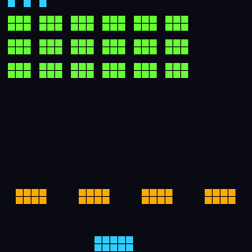
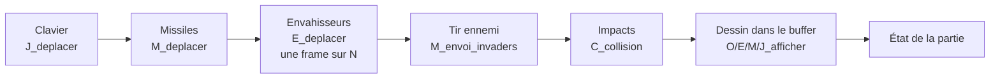

# RV32 Invaders

[](https://github.com/<utilisateur>/rv32-invaders/actions/workflows/tests.yml)

Un **Space Invaders écrit entièrement en assembleur RISC-V** (RV32IM), qui tourne dans le simulateur [RARS](https://github.com/TheThirdOne/rars).
Affichage par framebuffer mappé en mémoire, clavier par registres MMIO, aucune bibliothèque : environ 1 900 lignes d'assembleur commenté.

<p align="center">
  
</p>

> L'animation ci-dessus est une vraie partie, simulée en ligne de commande par `tests/capture.s` (un pilote automatique joue à la place du joueur) puis convertie en GIF par `tools/render_capture.py`.

## Fonctionnalités

- Vague de 18 envahisseurs qui balaie l'écran, descend à chaque bord et **accélère** à mesure que ses rangs s'éclaircissent.
- Les bords du groupe sont recalculés à partir des envahisseurs vivants : quand une colonne extérieure tombe, le groupe va plus loin.
- Tirs ennemis aléatoires, toujours lancés par l'envahisseur le plus bas de sa colonne.
- Murs de protection **destructibles** qui changent de couleur quand ils sont abîmés.
- Temps de recharge entre deux tirs du joueur, vies affichées en haut à gauche, score dans la console.
- Écran de fin encadré de vert (victoire), de rouge (défaite) ou de gris (abandon).
- Effets sonores MIDI non bloquants (désactivables).
- **Double buffer** : la scène est dessinée hors écran puis recopiée d'un bloc, sans scintillement.
- Tous les réglages (dimensions, vitesses, couleurs, touches…) regroupés dans un seul fichier, `src/config.s`.

## Ce qu'il faut installer

| Outil | Pourquoi | Obligatoire |
|---|---|---|
| **Java** 8 ou plus récent (JRE suffit) | RARS est une application Java | Oui |
| **RARS 1.6** ([`rars1_6.jar`](https://github.com/TheThirdOne/rars/releases/tag/v1.6)) | Simulateur RISC-V qui exécute le jeu | Oui |
| Bash + curl | Lancer `tools/run_tests.sh` (télécharge RARS si besoin) | Pour les tests |
| Python 3 + Pillow | Régénérer le GIF de démonstration | Non |

Vérifier Java : `java -version`. Sous Windows, macOS ou Linux, un double-clic sur `rars1_6.jar` ouvre RARS (ou `java -jar rars1_6.jar`).

## Lancer le jeu

1. **Ouvrir le jeu** : dans RARS, *File → Open* puis `src/main.s`. Les autres fichiers sont inclus automatiquement par `.include`.
2. **Configurer l'affichage** : *Tools → Bitmap Display*, puis régler :

   | Paramètre | Valeur |
   |---|---|
   | Unit Width / Height in Pixels | 16 / 16 |
   | Display Width / Height in Pixels | 512 / 512 |
   | Base address for display | `0x10040000 (heap)` |

   Cliquer sur **Connect to Program**.
3. **Configurer le clavier** : *Tools → Keyboard and Display MMIO Simulator*, puis **Connect to Program**.
4. **Assembler** (F3) puis **exécuter** (F5). Mettre le curseur de vitesse d'exécution au maximum.
5. **Jouer** : cliquer dans la zone de saisie du bas (*KEYBOARD*) du simulateur MMIO et utiliser les touches ci-dessous. Le score s'affiche dans l'onglet *Run I/O*.

| Touche | Action |
|---|---|
| `i` | Aller à gauche |
| `p` | Aller à droite |
| `o` | Tirer |
| `x` | Quitter la partie |

**Règles** : la partie est gagnée quand tous les envahisseurs sont détruits. Elle est perdue si le joueur n'a plus de vie ou si les envahisseurs atteignent la ligne des murs.

## Structure du dépôt

```
rv32-invaders/
├── src/
│   ├── main.s           Point d'entrée : boucle principale (frame, affichage, attente)
│   ├── config.s         Tous les paramètres du jeu
│   ├── affichage.s      I_ : framebuffer, rectangles, double buffer
│   ├── son.s            S_ : effets sonores MIDI
│   ├── donnees.s        J_ E_ O_ M_ : création et dessin des structures du jeu
│   ├── mouvement.s      J_ M_ E_ : clavier, déplacements, tirs
│   ├── collisions.s     C_ : détection des impacts (rectangles AABB)
│   └── partie.s         P_ : initialisation, déroulement d'une frame, fin de partie
├── tests/
│   ├── test_unitaires.s Tests des fonctions, en ligne de commande
│   ├── capture.s        Partie complète jouée par un pilote automatique, sans affichage
│   ├── test_affichage.s Test visuel du double buffer (dans RARS)
│   └── test_scene.s     Test visuel de la scène initiale (dans RARS)
├── tools/
│   ├── run_tests.sh     Assemblage + tests unitaires + partie complète
│   └── render_capture.py Conversion de la sortie de capture.s en GIF / PNG
├── docs/
│   ├── architecture.md  Architecture détaillée, structures mémoire, algorithmes
│   └── demo.gif, screenshot.png
└── .github/workflows/tests.yml  Intégration continue
```

## Architecture en bref

Chaque frame suit le même déroulé, piloté par `P_frame` :



`main.s` recopie ensuite le buffer vers l'écran (`I_buff_to_visu`) et attend 40 ms. Les structures du jeu (joueur, envahisseurs, murs, missiles) sont des tableaux alloués dans le tas avec `sbrk`. L'écran est placé en premier dans le tas pour tomber exactement à l'adresse `0x10040000` lue par le Bitmap Display.

Le détail des modules, des structures en mémoire et des algorithmes est dans [`docs/architecture.md`](docs/architecture.md).

## Conventions de code

- **Un préfixe par module** : `I_` affichage, `J_` joueur, `E_` envahisseurs, `O_` obstacles, `M_` missiles, `C_` collisions, `S_` son, `P_` partie, `T_` tests.
- **Chaque fonction est documentée** par un en-tête `Resume / Preconditions / Entrees / Sorties`.
- **Convention d'appel RISC-V respectée** : arguments dans `a0-a7`, résultats dans `a0-a1`, registres `s` et `ra` sauvegardés sur la pile dans un prologue et restaurés dans un épilogue.
- **Un commentaire par instruction significative**, au format `#registre : signification`.
- **Aucune valeur magique** : constantes, statuts et directions sont des mots nommés dans `config.s`.
- Les fonctions reçoivent l'adresse des structures en argument plutôt que de lire des variables globales, ce qui les rend testables.

## Tests

```bash
bash tools/run_tests.sh          # assemble tout, lance les tests unitaires et une partie complète
bash tools/run_tests.sh --demo   # idem, et régénère docs/demo.gif et docs/screenshot.png
```

- `tests/test_unitaires.s` vérifie 19 comportements : intersection de rectangles, conversions de coordonnées, placement des murs et des envahisseurs, remplissage de la table des missiles, demi-tour du groupe, impacts sur un envahisseur, un mur et le joueur. Le programme renvoie un code de sortie non nul en cas d'échec.
- `tests/capture.s` joue une partie entière sans affichage. Les registres du clavier sont redirigés vers deux mots en mémoire, qu'un pilote automatique remplit à chaque frame. C'est un test de bout en bout : la partie doit aller jusqu'à son terme sans erreur.
- L'intégration continue GitHub Actions lance `run_tests.sh` à chaque push.

## Pistes d'amélioration

- Collisions entre missiles et entre envahisseurs et joueur.
- Murs détruits case par case plutôt qu'en bloc.
- Vagues successives de plus en plus rapides, meilleur score conservé.
- Affichage du score directement à l'écran (police bitmap).

## Licence

Distribué sous licence MIT, voir [`LICENSE`](LICENSE).
