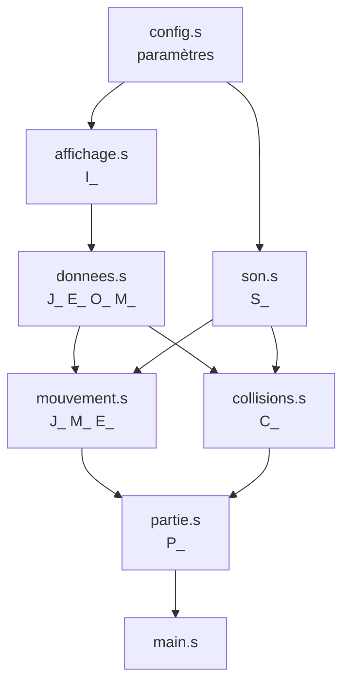

# Architecture

Ce document décrit l'organisation du code, la disposition des données en mémoire et les principaux algorithmes du jeu.

## Modules et dépendances

Les fichiers sont inclus « à plat » par `src/main.s`, dans l'ordre de leurs dépendances. Aucun module ne contient d'instruction exécutée au chargement : la première instruction du programme est le `j main` de `main.s`.



| Module | Rôle | Fonctions principales |
|---|---|---|
| `config.s` | Paramètres et constantes nommées | — |
| `affichage.s` | Allocation de l'image, dessin, double buffer | `I_creer`, `I_rectangle`, `I_effacer`, `I_buff_to_visu` |
| `son.s` | Effets sonores MIDI asynchrones | `S_tir`, `S_explosion`, `S_touche` |
| `donnees.s` | Création et dessin des structures | `J_creer`, `E_creer`, `O_creer`, `M_creer`, `M_ajouter_missile`, `*_afficher` |
| `mouvement.s` | Clavier, déplacements, tirs | `J_deplacer`, `M_deplacer`, `E_deplacer`, `M_envoi_missile`, `M_envoi_invaders` |
| `collisions.s` | Détection et conséquences des impacts | `C_intersecte_rectangles`, `C_collision` |
| `partie.s` | Cycle de vie d'une partie | `P_initialiser`, `P_frame`, `P_fin` |
| `main.s` | Boucle temps réel | `main` |

## Mémoire

### Disposition du tas

Toutes les structures sont allouées une seule fois, au début de la partie, avec l'appel système `sbrk` (`ecall 9`). L'ordre d'allocation compte : l'image affichée doit être la première pour se trouver à `0x10040000`, l'adresse lue par le Bitmap Display en mode *heap*.

```
0x10040000  I_visu   image affichée      32 × 32 units × 4 octets = 4 Ko
            I_buff   buffer de dessin    4 Ko
            joueur                       3 mots
            missiles                     12 × 4 mots
            murs                         4 × 2 mots
            envahisseurs                 2 + 18 × 3 mots
```

Un unit (case de la grille) occupe un mot au format `0x00RRGGBB`. L'adresse du unit `(x, y)` vaut `base + 4 × (y × largeur + x)`.

### Structures

Toutes les tailles sont en mots de 4 octets ; les décalages sont relatifs au début de l'élément.

**Joueur** (3 mots)

| Décalage | Contenu |
|---|---|
| +0 | Abscisse gauche |
| +4 | Vies restantes |
| +8 | Recharge : frames restantes avant le prochain tir possible |

**Envahisseurs** (2 mots d'en-tête + 3 mots par envahisseur)

| Décalage | Contenu |
|---|---|
| +0 | Direction du groupe (`invaders_direction_right` / `_left`) |
| +4 | Nombre d'envahisseurs en vie |
| +8 + 12·i | Abscisse de l'envahisseur i |
| +12 + 12·i | Ordonnée de l'envahisseur i |
| +16 + 12·i | Statut vital de l'envahisseur i |

**Murs** (2 mots par mur ; l'ordonnée commune est dans `walls_y_position`)

| Décalage | Contenu |
|---|---|
| +0 + 8·i | Abscisse du mur i |
| +4 + 8·i | Résistance restante (0 : détruit) |

**Missiles** (4 mots par emplacement, `missiles_maximum` emplacements partagés par le joueur et les envahisseurs)

| Décalage | Contenu |
|---|---|
| +0 + 16·i | Abscisse |
| +4 + 16·i | Ordonnée |
| +8 + 16·i | Direction (`missiles_direction_up` / `_down`) |
| +12 + 16·i | Existence (`missiles_exist_status` / `_not_exist_status`) |

Un missile détruit n'est pas retiré du tableau : son emplacement est simplement marqué comme libre et sera réutilisé par `M_ajouter_missile`.

## Boucle de jeu

`main` appelle `P_frame` en boucle. `P_frame` exécute une étape complète et renvoie l'état de la partie ; elle ne touche ni à l'écran ni au temps, ce qui permet de la piloter depuis un programme de test.

```
main :
    P_initialiser(graine = heure courante)
    répéter
        état = P_frame()            // logique + dessin dans I_buff
        si état != en cours : sortir
        I_buff_to_visu()            // copie vers l'écran
        attendre frame_delay ms
    P_fin(état)                     // cadre de couleur + message
```

Déroulé de `P_frame` :

1. Incrémente le compteur de frames.
2. `J_deplacer` : décompte la recharge, lit le clavier, déplace le joueur ou tire. Renvoie 1 si `x` est pressé.
3. `M_deplacer` : fait avancer chaque missile et libère ceux qui sortent de l'écran.
4. Si `frame mod période = 0` : `E_deplacer`. La période vaut `invaders_min_period + vivants / invaders_speed_divisor`, donc de 8 frames au départ à 2 frames pour le dernier envahisseur.
5. Si `frame mod invaders_shot_period = 0` : `M_envoi_invaders`.
6. `C_collision` : renvoie les points gagnés et si le joueur a été touché ; le score est mis à jour et réaffiché si quelque chose a changé.
7. Efface le buffer et dessine murs, envahisseurs, missiles puis joueur.
8. Détermine l'état : victoire si plus aucun envahisseur (prioritaire), défaite si le groupe a atteint les murs ou si le joueur n'a plus de vie.

## Algorithmes

### Intersection de rectangles (AABB)

Tous les objets sont des rectangles alignés sur la grille. Deux rectangles se chevauchent si et seulement si, sur chaque axe, chacun commence avant la fin de l'autre :

```
x1 < x2 + l2  et  x2 < x1 + l1  et  y1 < y2 + h2  et  y2 < y1 + h1
```

`C_intersecte_rectangles` implémente ce test en quatre comparaisons, avec sortie dès la première qui échoue. Comme les missiles avancent d'une case par frame et que tous les objets font au moins une case de haut, un missile ne peut pas « traverser » une cible entre deux frames.

### Déplacement du groupe d'envahisseurs

`E_deplacer` parcourt d'abord les envahisseurs vivants pour calculer l'abscisse la plus à gauche, l'abscisse la plus à droite et l'ordonnée la plus basse du groupe. Ensuite :

- si le bas du groupe atteint la ligne des murs, la fonction signale la défaite ;
- si le prochain pas horizontal ferait sortir le groupe de l'écran (marge comprise), tout le groupe descend d'une ligne et change de direction ;
- sinon, toutes les abscisses sont décalées d'un pas.

### Choix du tireur ennemi

`M_envoi_invaders` tire un rang aléatoire `k` dans `[0, vivants[` (`ecall 42`) et sélectionne le k-ième envahisseur vivant. Elle remonte ensuite vers l'envahisseur vivant le plus bas de la même colonne, pour que les missiles ne traversent pas les envahisseurs du dessous. Le générateur est initialisé une fois avec l'heure (`ecall 40`), ou avec une graine fixe dans les tests pour que les parties soient reproductibles.

### Double buffer

Le dessin d'une frame consiste en plusieurs centaines d'écritures en mémoire. Faites directement dans la zone lue par le Bitmap Display, on verrait l'image se construire. Tout est donc dessiné dans `I_buff`, puis `I_buff_to_visu` recopie les 1 024 mots d'un bloc dans `I_visu`.

## Convention d'appel

Le code suit la convention d'appel standard RISC-V :

| Registres | Usage | Préservés par l'appelé |
|---|---|---|
| `a0-a7` | Arguments, `a0-a1` pour les résultats | Non |
| `t0-t6` | Temporaires | Non |
| `s0-s11` | Variables qui doivent survivre aux appels | Oui (prologue / épilogue) |
| `ra` | Adresse de retour | Sauvegardé dans chaque prologue |
| `sp` | Pointeur de pile, aligné sur des mots | Oui |

Chaque fonction commence par un prologue qui réserve la pile et sauvegarde `ra` et les registres `s` utilisés, et se termine par l'épilogue symétrique. `I_rectangle` va plus loin et restaure aussi ses arguments `a0-a4`, ce qui permet de dessiner plusieurs objets de même taille et de même couleur sans recharger les dimensions.

## Tests sans matériel

Les adresses des registres du clavier ne sont pas écrites en dur : elles sont lues dans `keyboard_status_address` et `keyboard_data_address`. `tests/capture.s` les redirige vers deux mots ordinaires de la section `.data`, qu'un pilote automatique remplit avant chaque frame. Le jeu complet tourne ainsi en ligne de commande (`java -jar rars.jar nc tests/capture.s`), sans Bitmap Display ni clavier. Après chaque frame, le buffer est écrit dans la console ; `tools/render_capture.py` le transforme en GIF.
